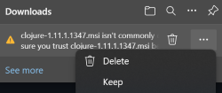
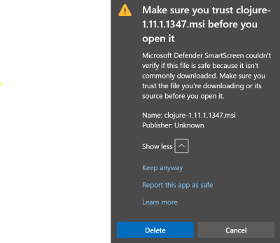

# Clojure Installer

This repo contains a script to build an MSI package for installing Clojure. It downloads the Windows binaries for the latest version of [deps.clj](https://github.com/borkdude/deps.clj), [ClojureTools](https://github.com/clojure/brew-install), and the [WiX toolset](https://wixtoolset.org/releases/) automatically and creates a combined installer file. The installer supports per-user or per-machine (requires elevation) installation.

New releases should appear automatically shortly after the release of [deps.clj](https://github.com/borkdude/deps.clj) versions.

## How to install

Download the latest MSI from the [releases](https://github.com/casselc/clj-msi/releases/latest). Depending on your browser you may see warnings about the installer being an infrequently downloaded file - you will need to select the option to keep the file/continue downloading.

After downloading, double-click the MSI file or run `msiexec.exe /i clojure-x.x.xx.msi` from a command prompt or PowerShell session. In PowerShell, be careful of the shell automatically changing the path from `clojure-x.x.xxx.msi` to `.\clojure-x.x.xxx.msi`, the latter format will cause `msiexec` to report an error.

### Advanced options

You can use `msiexec.exe /i clojure-x.x.xx.msi /qn` for a silent installation.

Currently the installer defaults to `%LOCALAPPDATA%\Apps\clojure` or `%ProgramFiles%\clojure` depending on whether you select a per-user or per-machine installation, and the installation directory can be changed by using the Advanced option during installation, or at the command line by settingsthe `APPLICATIONFOLDER` property, e.g. `msiexec.exe /i clojure-x.x.xx.msi /qn APPLICATIONFOLDER=C:\somewhere\else\clojure`

## How to uninstall

Use Add/Remove Programs, or `msiexec.exe /x clojure-x.x.xxx.msi`

## How to build the MSI

See the [build docs](docs/BUILDING.md).
